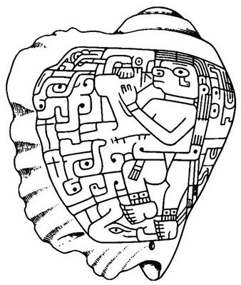
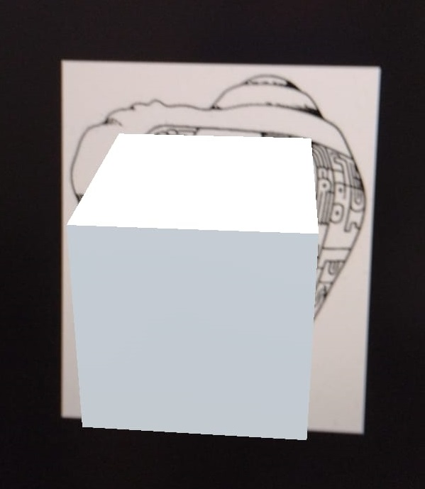
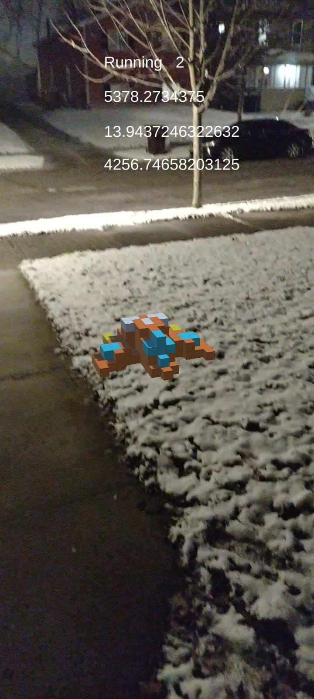

# AR demo1

## Image target for tracking in AR
By using Vuforia Engine in Unity, we created an image-target app. 

**This is the image-target**

 

## Geolocation for AR tracking 
This work uses AR+GPS Location package, and we have got a first positive result. 

Data produce by this project have been published under [license Creative Commons (CC BY 4.0 IT](https://creativecommons.org/share-your-work/): This license enables reusers to distribute, remix, adapt, and build upon the material in any medium or format, so long as attribution is given to the creator. 

